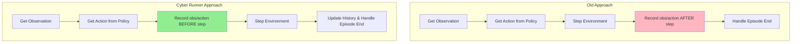
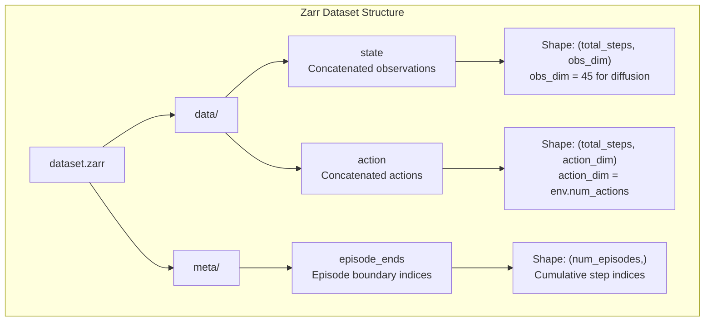

# Legged Gym Dataset Interface: Old vs Cyber Runner

This document explains the key differences between the original legged gym dataset generation approach and the new cyber_runner approach, focusing on observation handling, action collection, and data structures.

## Overview

The cyber_runner implementation introduces several critical technical improvements over the standard approach that ensure proper data collection for diffusion policy training.

## Key Differences

### 1. Observation Handling

#### Old Approach
- Used raw environment observations directly
- Simple observation buffering without proper history management
- No specialized observation processing

#### Cyber Runner Approach  
- Uses `env.get_diffusion_observation()` for specialized observation format
- Maintains proper state history with `(num_envs, history+1, obs_dim)` structure
- Implements delayed observation inputs for temporal consistency

```python
# Old approach
obs = env.step(action)[0]

# Cyber runner approach  
state_history[:, -1, :] = env.get_diffusion_observation().to(device)
obs_dict = {"obs": state_history[:, -policy.n_obs_steps-1:-1, :]}  # Delayed inputs
```

### 2. Expert Policy Loading

#### Old Approach
- Complex policy loading through training framework
- Required full training configuration reconstruction
- Separate handling for JIT vs training checkpoints

#### Cyber Runner Approach
- Direct checkpoint loading: `torch.load(checkpoint_path)`
- Simple inference call: `expert_policy.act_inference(obs.detach())`
- Unified interface regardless of checkpoint type

### 3. Data Collection Timing

#### Old Approach
- Collected data after environment stepping
- Potential mismatch between observations and corresponding actions
- Standard episode termination handling

#### Cyber Runner Approach
- **Records obs/actions BEFORE stepping** (critical difference)
- Ensures perfect alignment between state and action pairs
- Proper episode boundary handling with history reset



### 4. State History Management

#### Old Approach
```python
# Simple observation stacking
obs_history = torch.cat([obs_history[1:], obs.unsqueeze(0)], dim=0)
```

#### Cyber Runner Approach
```python
# Proper rolling history with correct dimensions
state_history = torch.roll(state_history, shifts=-1, dims=1)
state_history[:, -1, :] = env.get_diffusion_observation().to(device)
```

### 5. Episode Recording Structure

Both approaches use similar episode recording arrays, but with different update patterns:

```mermaid
graph LR
    subgraph "Episode Recording Structure"
        A[recorded_obs_episode<br/>shape: (num_envs, max_episode_length+2, obs_dim)]
        B[recorded_acs_episode<br/>shape: (num_envs, max_episode_length+3, action_dim)]
        
        A --> C[Episode Completion Check]
        B --> C
        C --> D{Episode Length > 400?}
        D -->|Yes| E[Save to Dataset]
        D -->|No| F[Discard Episode]
        E --> G[Reset Episode Buffer]
        F --> G
    end
```

## Data Structure Comparison

### Final Dataset Format



### Key Dimensions

| Component | Old Approach | Cyber Runner | Notes |
|-----------|--------------|--------------|-------|
| Observation Dim | Variable (env.num_obs) | Fixed (45) | Diffusion observation format |
| History Buffer | `(history, obs_dim)` | `(num_envs, history+1, obs_dim)` | Proper parallel env support |
| Action Buffer | `(history, action_dim)` | `(num_envs, history, action_dim)` | Consistent with state buffer |
| Episode Min Length | Variable | 400 steps | Quality filter for training |

## Critical Technical Improvements

### 1. Temporal Alignment
- **Old**: Potential 1-step misalignment between obs and actions
- **Cyber**: Perfect alignment through pre-step recording

### 2. History Management  
- **Old**: Simple concatenation, potential memory issues
- **Cyber**: Efficient rolling buffers with proper device handling

### 3. Multi-Environment Handling
- **Old**: Sequential processing with potential race conditions
- **Cyber**: Proper parallel environment state management

### 4. Episode Boundary Handling
- **Old**: Standard reset without history consideration
- **Cyber**: History-aware reset ensuring clean episode boundaries

## Usage Examples

### Cyber Runner Dataset Generation
```python
# Load expert policy (simplified)
expert_policy = torch.load('checkpoint.pt', map_location='cuda:0')

# Initialize proper history buffers
state_history = torch.zeros((num_envs, history+1, 45), device=device)
action_history = torch.zeros((num_envs, history, num_actions), device=device)

# Data collection loop
while collecting:
    # Get current state for recording
    current_obs = state_history[:, -1, :] 
    
    # Get expert action
    expert_action = expert_policy.act_inference(obs.detach())
    
    # Record BEFORE stepping (key difference)
    recorded_obs_episode[env_ids, curr_idx, :] = current_obs.cpu().numpy()
    recorded_acs_episode[env_ids, curr_idx, :] = expert_action.cpu().numpy()
    
    # Then step environment
    obs, _, _, done, _ = env.step(expert_action)
    
    # Update history with new observation
    state_history = torch.roll(state_history, shifts=-1, dims=1)
    state_history[:, -1, :] = env.get_diffusion_observation()
```

## Migration Guide

When updating from old approach to cyber runner:

1. **Update observation handling**: Use `get_diffusion_observation()` if available
2. **Fix recording timing**: Move data recording before environment stepping
3. **Implement proper history**: Use rolling buffers instead of concatenation
4. **Handle episode resets**: Reset history buffers for terminated environments
5. **Update policy interface**: Use direct checkpoint loading and `act_inference()`

## Performance Implications

- **Memory**: More efficient through rolling buffers vs concatenation
- **Compute**: Reduced overhead from simplified policy loading
- **Data Quality**: Higher quality through proper temporal alignment
- **Parallelization**: Better multi-environment scaling

The cyber runner approach ensures that the collected dataset maintains the exact temporal relationships required for successful diffusion policy training.